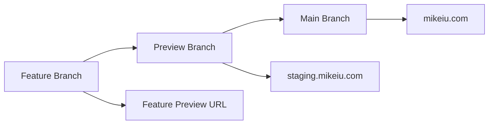
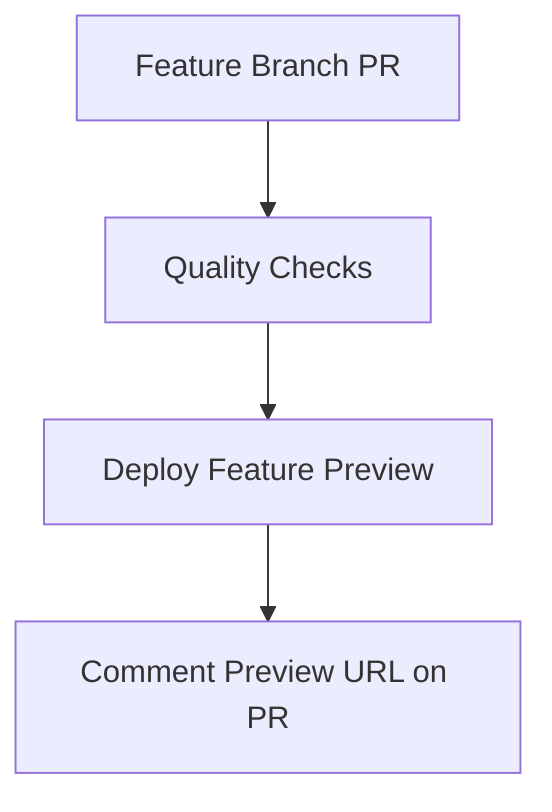
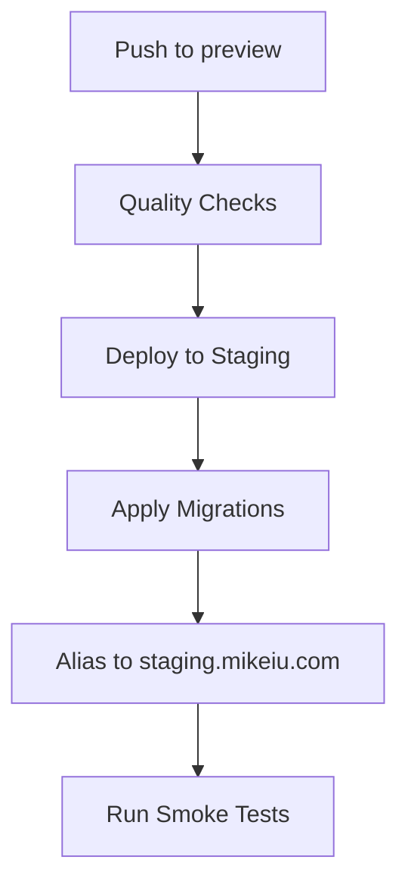
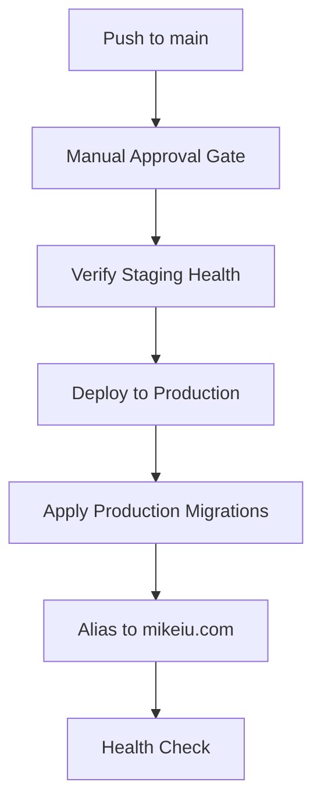

# Deployment Pipeline Documentation

## Overview

The deployment pipeline implements a **two-environment branching strategy** with controlled promotion from preview to production. Feature branches target the `preview` branch, which automatically deploys to staging for validation before manual promotion to production.

## Branching Strategy



### **Git Workflow:**

- **Default Branch**: `preview` (feature branches target this)
- **Production Branch**: `main` (requires manual promotion)
- **Feature Branches**: `feat/*`, `fix/*`, `chore/*`

## Pipeline Flows

### 1. Feature Branch Pipeline (feature-preview.yml)



### 2. Preview Branch Pipeline (staging-deploy.yml)



### 3. Production Pipeline (production-deploy.yml)



## Stages

### 1. Quality Checks

- Installs dependencies with pnpm caching
- Runs typecheck across monorepo
- Runs lint checks
- Builds apps/web and packages/ui
- Uploads build artifacts for reuse

### 2. Staging Deployment

- Downloads build artifacts
- Applies Supabase migrations to staging environment
- Deploys to Vercel
- Aliases deployment to staging.mikeiu.com

### 3. Staging Validation

- Waits for staging deployment to be ready
- Runs smoke tests against staging.mikeiu.com
- Uploads test results on failure

### 4. Production Promotion (Manual Gate)

- Requires manual approval via GitHub environments
- Promotes the same build from staging to production
- Aliases to mikeiu.com
- Runs post-deployment health checks

## Environment Configuration

### GitHub Environments

#### Staging

- Automatic deployment on main branch push
- No manual approval required
- Used for pre-production testing

#### Production

- Manual approval required
- Protected environment
- Only deploys after staging validation passes

### Required Secrets

The following secrets must be configured in GitHub repository settings:

**Repository Secrets:**

- `VERCEL_TOKEN` - Vercel deployment token
- `VERCEL_ORG_ID` - Vercel organization ID
- `VERCEL_PROJECT_ID` - Vercel project ID
- `SUPABASE_ACCESS_TOKEN` - Supabase CLI access token
- `SUPABASE_STAGING_PROJECT_REF` - Staging Supabase project reference
- `SUPABASE_PROD_PROJECT_REF` - Production Supabase project reference

**Environment Secrets:**
Configure the same secrets for both staging and production environments.

## Migration Strategy

### Database Migrations

- Migrations are applied to staging first
- Dry-run validation before actual application
- Non-destructive migrations only
- Manual intervention required for migration failures

### Deployment Artifacts

- Build once, deploy twice pattern
- Same artifacts used for staging and production
- No rebuild during promotion
- Artifact retention for rollback capability

## Monitoring and Alerts

### Health Checks

- Automated health check at `/api/health`
- Post-deployment validation
- Retry logic for temporary failures

### Failure Handling

- Migration failures block deployment
- Smoke test failures block production promotion
- Manual intervention required for pipeline failures

## Manual Operations

### Triggering Manual Deployment

```bash
# Via GitHub CLI
gh workflow run "Main Pipeline" --ref main
```

### Approving Production Deployment

1. Navigate to GitHub Actions workflow run
2. Review staging deployment and test results
3. Click "Review deployments"
4. Select "production" environment
5. Add approval comment and approve

### Emergency Rollback

See [deployment-rollback.md](deployment-rollback.md) for emergency procedures.

## Troubleshooting

### Common Issues

#### Migration Failures

- Check Supabase project connectivity
- Verify migration file syntax
- Review database state in staging

#### Deployment Failures

- Check Vercel token permissions
- Verify project configuration
- Review build artifacts

#### Smoke Test Failures

- Check staging deployment health
- Review application logs
- Verify environment configuration

### Getting Help

- Check GitHub Actions logs for detailed error messages
- Review Vercel deployment logs
- Check Supabase migration history

## Scripts

The following scripts are available for manual operations:

- `scripts/apply-migrations.sh` - Apply migrations manually
- `scripts/deploy-staging.sh` - Deploy to staging manually
- `scripts/promote-production.sh` - Promote to production manually

## Performance

### Pipeline Timing

- Quality checks: ~3-5 minutes
- Staging deployment: ~2-3 minutes
- Smoke tests: ~1-2 minutes
- Production promotion: ~1-2 minutes
- Total: ~7-12 minutes

### Optimization

- Dependency caching reduces install time
- Artifact reuse avoids rebuilding
- Parallel job execution where possible
