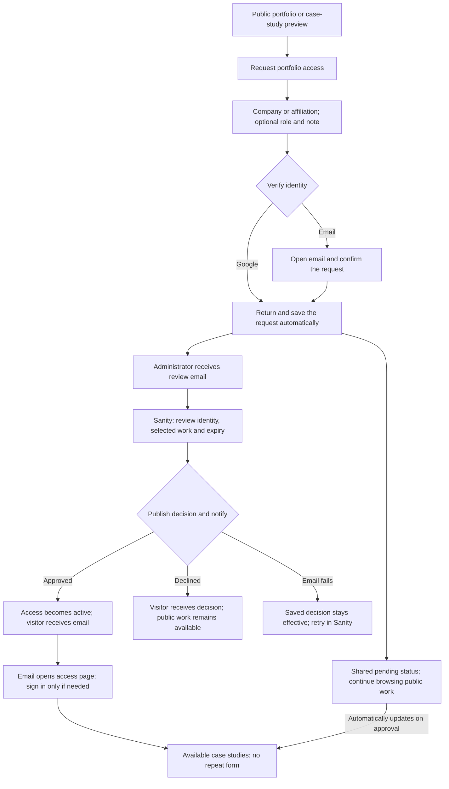

# Portfolio access experience

Visitors request portfolio access once, using Google or an email link to verify their identity. Company or affiliation is required; role and a note are optional. Ordinary sign-in never creates a request.

## Implementation plan

1. Replace project-specific requests with one portfolio request per verified visitor. Preserve existing grants and enforce current Sanity domain blocks before any additional access.
2. Carry request details safely through authentication, including email links opened on another device. Submit only after verification and explicit request intent. Preserve input when authentication fails.
3. Add a shared portfolio access page and site-wide status. Pending requests update automatically after approval; returning visitors read approved work without another form.
4. Use a standard case-study selection in Sanity to initialize approvals. Reviewers see the exact scope, can choose exceptions or expiry, and approve or decline with visitor notification. Separate the decision from email delivery and expose retries.
5. Verify validation, permissions, duplicate submissions, authentication continuation, approval, decline, expiry, notification failure and recovery. Run project checks and click through localhost:3333 before updating draft PR #120 to Preview.

## Experience contract

- Public summaries remain useful before access. Listing and project links distinguish previewing a study from requesting portfolio access.
- Google: request details, Google verification, then saved request or existing access. Email: request details and email, verification, then the same result. No second request form follows sign-in.
- A saved request shows its verified email and explains that a decision arrives by email. Status is available from the account menu and portfolio pages.
- Approval activates access first. The visitor email opens the portfolio; authentication, if needed, returns them to the approved work. An email failure never erases a saved decision.
- On Vercel Preview, email links use that branch’s URL. Production and local delivery use the website URL configured in Sanity.
- Sanity remains the source of domain rules, access scope, expiry and notification recipients. No company domain is hardcoded.
- Standard selections are copied into each request for review. Changing a default does not silently broaden existing grants. Empty selections fail closed.
- Existing project grants retain their original scope. Existing pending requests remain reviewable without creating a second pending request for the same visitor.
- No production dataset changes or production deployment are part of this work. Real administrator and visitor inbox delivery must be verified before rollout; the earlier rejected Resend credential is an external dependency until resolved.

## Verification and review

- Automated: 267 unit tests pass, covering request continuation and identity binding, duplicate submissions, legacy grants, blocks, approval scope, expiry, failed notifications and retries. TypeScript, lint, production build, the separate Sanity schema/action typecheck and Storybook build pass.
- Browser: the combined Google request path was exercised with an isolated local authentication fixture and real development Sanity. Affiliation alone produced a saved pending request, a captured administrator email, then a captured approval email and an automatically updated approved access page. Actual Sanity login used the g.maicle account; the notification retry action and its confirmation dialog were exercised.
- The Mac locked during the remaining browser work. The email-link journey, returning approved visitor sign-in and phone-width visual review still need a complete manual pass. Automated coverage is not a substitute for those pending checks.
- Email delivery is captured locally for tests. The existing Preview Resend credential previously returned HTTP 401; real inbox delivery remains unverified until an active sending credential is configured and the saved notification is retried.
- The earlier review also found that the Sanity datasets are public. Website gates do not make directly queryable CMS content private. Dataset privacy and confidential asset delivery remain rollout prerequisites; no production dataset settings were changed here.
